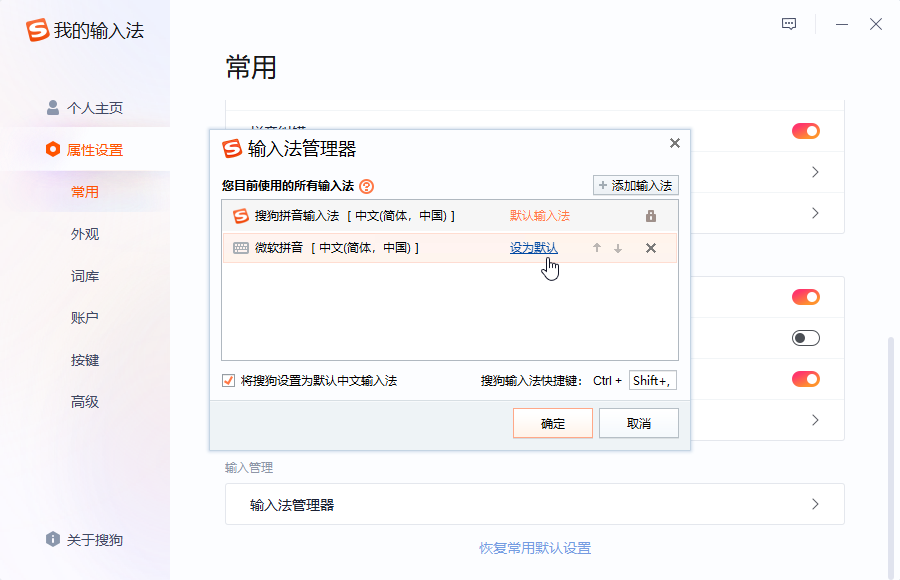

> 使用环境
>
> - Windows 10 64 位 专业版 21H1
>   - 用户 Administrator

## 下载

下载地址 [搜狗拼音输入法 11.2 正式版 | 阿里云盘](https://www.aliyundrive.com/s/8P2ZtPNuNob) 或到 [官网](https://pinyin.sogou.com/) 下载最新版。

<!--truncate-->

## 安装

一直下一步即可安装完成。

## 定制状态栏

- 状态栏右键 > 定制状态栏。
- 仅保留**中/英文**、**全/半角**、**中/英文标点**。

## 设置

### 设置默认输入法

搜狗拼音输入法安装完成后默认会将其设置为系统默认输入法。可以通过以下方式修改系统默认输入法。

- 状态栏右键 > 更多设置 > 属性设置 > 常用。
- 点击**输入法管理器**。
- 在需要设置为默认输入法的输入法上点击**设为默认**。

### 修改切换到搜狗输入法快捷键

切换到搜狗输入法快捷键默认使用 <kbd>Ctrl</kbd> + <kbd>,</kbd> ，这和很多编辑器（如 VSCode）的**设置**快捷键冲突。

下面将切换到搜狗输入法快捷键改为 <kbd>Ctrl</kbd> + <kbd>Shift</kbd> + <kbd>,</kbd> 。

- 状态栏右键 > 更多设置 > 属性设置 > 常用。
- 点击**输入法管理器**。
- 将光标定位到**搜狗输入法快捷键**后的输入框里，按 <kbd>Shift</kbd> + <kbd>, </kbd> 。

### 其他设置

- 禁用搜狗输入法的系统功能快捷键
  - 状态栏右键 > 更多设置 > 属性设置 > 按键。
  - 将**系统功能快捷键**设置为关闭状态。
  - 因为有一些快捷键和常用编辑器快捷键冲突。
- 将默认输入语言改为英文
  - 状态栏右键 > 更多设置 > 属性设置 > 常用。
  - 将**中文/英文**设置为**英文**。
  - 因为我更喜欢使用 <kbd>Ctrl</kbd> + <kbd>Space</kbd> 来切换中/英文输入状态，而不是使用 <kbd>Ctrl</kbd> + <kbd>Shift</kbd> 来切换到另一个输入法。
- 关闭自动升级
  - 状态栏右键 > 更多设置 > 属性设置 > 高级。
  - 将**升级模式**设置为**提示升级**。
- 关闭按 <kbd>Shift</kbd> 键切换中英文输入状态
  - 状态栏右键 > 更多设置 > 属性设置 > 按键。
  - 将**中英切换**设置为**无**。
  - 关闭后依然可以使用 <kbd>Ctrl</kbd> + <kbd>Space</kbd> 来切换中英文输入状态。
