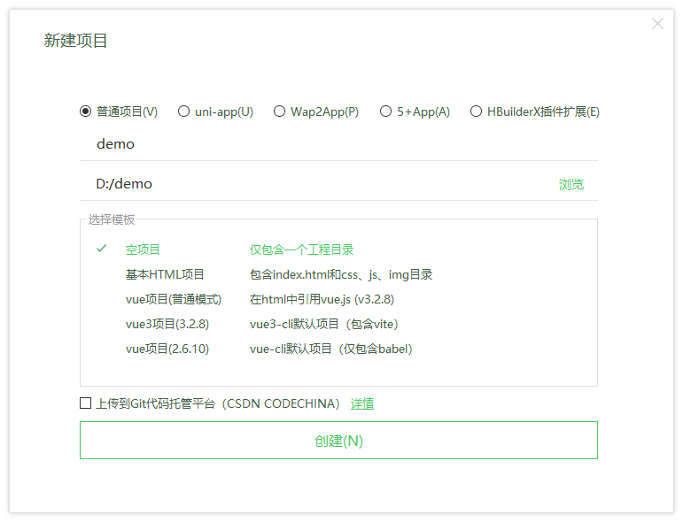
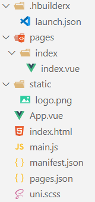
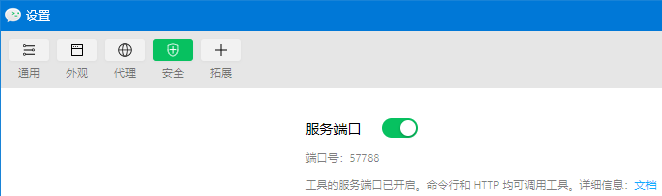
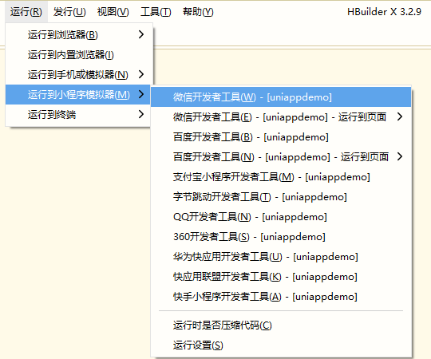
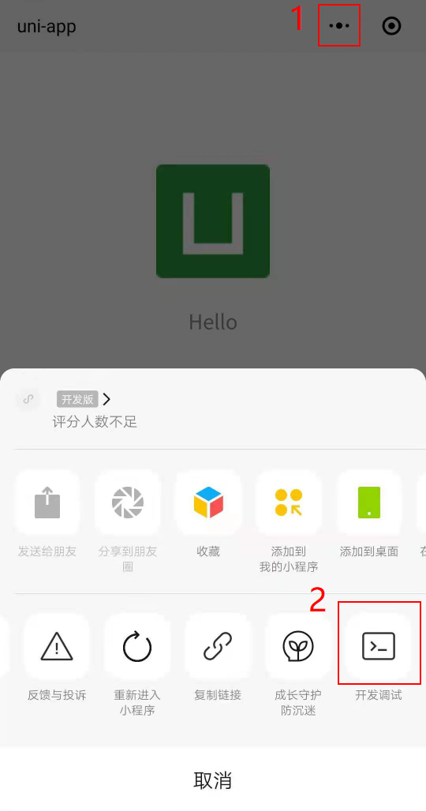

## 使用 [HBuilderX](https://www.dcloud.io/hbuilderx.html) 创建 [uni-app](https://uniapp.dcloud.io/) 项目



如上，将会在 `D:/demo` 目录下新建一个 `demo` 目录，所有项目文件都位于 `D:/demo/demo` 目录下，而不是 `D:/demo` 目录下。

## 默认目录结构



> 项目根目录中还有一个 `.DS_Store` 文件，在编辑器中没有显示出来。

### Git 中忽略 `.DS_Store` 文件和 `unpackage` 目录

首先在项目根目录中创建 `.gitignore` 文件，然后在 `.gitignore` 文件中输入如下内容
```
.DS_Store
unpackage/
```

## 运行到微信开发者工具

要想查看微信小程序运行效果，必须将项目运行到[微信开发者工具](https://developers.weixin.qq.com/miniprogram/dev/devtools/download.html)。

首先需要在微信开发者工具中开启*服务端口*



然后在 HBuilderX 中选择 *运行* > *运行到小程序模拟器* > *微信开发者工具*



运行后会在项目根目录产生一个 `unpackage` 目录。

如果第一次未运行成功，可停止运行后再次运行。

## 手机中查看运行效果

首先微信开发者工具不能是游客模式，要使用扫码登录。

其次要在 uni-app 项目中的 `manifest.json` 中填入登录微信开发者工具的微信用户的微信小程序 AppID 。

然后再运行项目。

项目运行后就可点击微信开发者工具中工具栏上的*预览*，然后用微信扫码来预览项目。

## 无法发送网络请求？

在测试期间，如需发送网络请求，需要做如下设置

- 微信开发者工具中测试
  - 需要勾选*不校验合法域名、web-view（业务域名）、TLS 版本及 HTTPS 证书*。
- 手机中测试
  - 需要开启*开发调试*。

